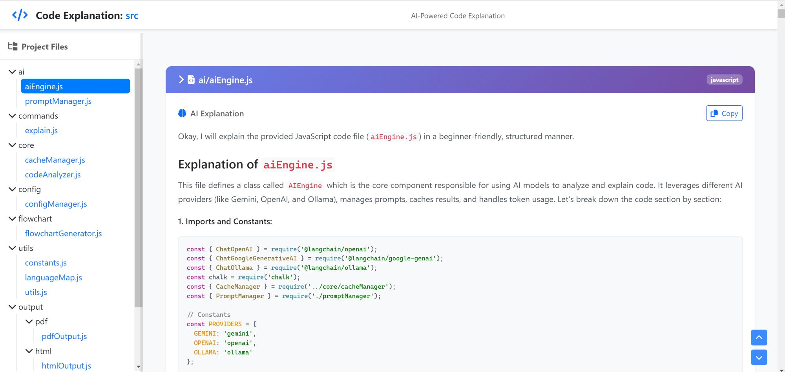

# CodeExplain

An AI-powered code explanation tool that generates interactive documentation for codebases. Analyze code files or entire projects and get AI-generated explanations in multiple modes with support for various output formats.



## Features

- **Multiple Explanation Modes**: explain, line-by-line, architecture, issues, onboarding
- **AI Provider Support**: Google Gemini, OpenAI, Ollama with caching and retry logic
- **Output Formats**: Interactive HTML (with syntax highlighting, themes, search) or static PDF
- **Offline Mode**: Generate explanations without AI for cached content
- **Comprehensive Language Support**: 50+ programming languages including web, backend, systems, and functional programming
- **Smart Filtering**: Include-based filtering with gitignore support and user-defined exclusions
- **Progress Tracking**: Real-time progress with file counts and completion percentages

## Installation

```bash
npm install -g codeexplain
```

## Usage

```bash
codeexplain [options] [path]
```

### Arguments
- `paths`: Path(s) to file(s)/folder(s) to explain (comma-separated for multiple) (default: ".")

### Options
- `-V, --version`: Output the version number
- `-o, --output <type>`: Output format (html/pdf) (default: "html")
- `-m, --mode <mode>`: Explanation mode (explain/linebyline/architecture|arch/issues/onboarding) (default: "explain")
- `--model <model>`: AI model to use (e.g., gemini-pro, gpt-4-turbo)
- `-c, --config <path>`: Path to custom config file
- `--apikey <key>`: API key for AI provider
- `--no-cache`: Skip cache and regenerate all explanations
- `--clean-cache`: Clean all cached explanations
- `-h, --help`: Display help for command

## Examples

```bash
# Explain current directory in offline mode
codeexplain

# Explain a specific file with AI
codeexplain src/main.js --apikey YOUR_API_KEY

# Explain multiple specific files
codeexplain src/ai/aiEngine.js,src/ai/promptManager.js --apikey YOUR_API_KEY

# Explain an entire folder
codeexplain ./src --apikey YOUR_API_KEY

# Generate architecture overview in PDF format
codeexplain --mode architecture --output pdf --apikey YOUR_API_KEY

# Use custom config and specific model
codeexplain --config ./my-config.json --model gpt-4-turbo --apikey YOUR_API_KEY

# Clean all cached explanations
codeexplain --clean-cache
```

## Configuration

CodeExplain uses a configuration file at `.codeexplain/config.json` (auto-generated on first run). You can customize:

- AI provider and model settings
- Output preferences
- File extensions to include/exclude
- Retry logic parameters
- Cache behavior

### Supported Languages

Includes 50+ languages such as JavaScript, TypeScript, Python, Java, C/C++, Go, Rust, Ruby, PHP, and many more.

## Project Structure

```
CodeExplain/
├── .codeexplain/          # User config and custom prompts
├── bin/
│   └── codeexplain.js     # CLI entry point
├── prompts/               # Default AI prompt templates
├── src/
│   ├── ai/                # AI provider integration
│   ├── commands/          # CLI command handlers
│   ├── config/            # Configuration management
│   ├── core/              # Core functionality (caching, analysis)
│   └── output/            # Output generators (HTML, PDF)
└── tests/                 # Jest test files
```

## Development

### Prerequisites
- Node.js
- npm

### Setup
```bash
git clone <repository-url>
cd CodeExplain
npm install
```

### Testing
```bash
npm test
```

### Building
```bash
npm run build
```

## Contributing

1. Fork the repository
2. Create a feature branch
3. Make your changes
4. Add tests if applicable
5. Run tests: `npm test`
6. Submit a pull request

## License

MIT License - see LICENSE file for details

## Support

For issues and questions:
- Report bugs: https://github.com/sst/opencode/issues
- Get help: /help command in opencode